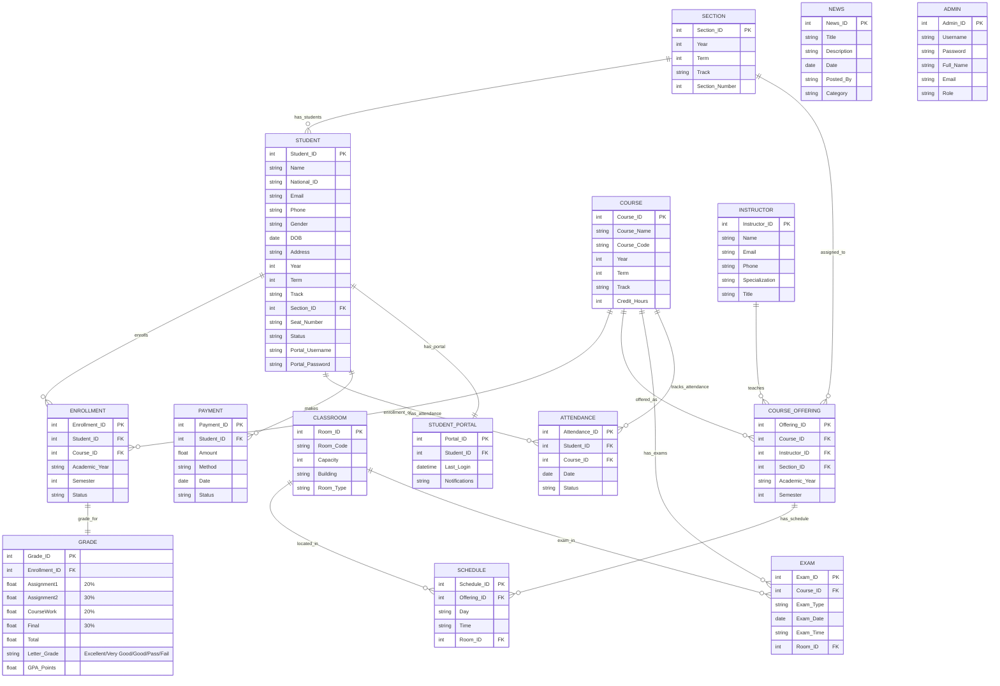

# 🎓 SIS University System - ERD
## Entity Relationship Diagram - نظام إدارة الجامعة

---

## 🔗 Relationships Summary

| From | To | Relationship | Description |
|------|-----|--------------|-------------|
| Section | Student | 1:N | Section contains many students |
| Student | Enrollment | 1:N | Student enrolls in many courses |
| Course | Enrollment | 1:N | Course has many enrollments |
| Enrollment | Grade | 1:1 | Each enrollment has one grade record |
| Course | Course_Offering | 1:N | Course offered multiple times |
| Instructor | Course_Offering | 1:N | Instructor teaches many offerings |
| Section | Course_Offering | 1:N | Section has many offerings |
| Course_Offering | Schedule | 1:N | Offering has multiple schedule slots |
| Classroom | Schedule | 1:N | Classroom used in many schedules |
| Course | Exam | 1:N | Course has multiple exams (S1, S2, Final) |
| Student | Attendance | 1:N | Student has attendance records |
| Course | Attendance | 1:N | Course tracks attendance |
| Student | Payment | 1:N | Student makes payments |
| Student | Student_Portal | 1:1 | Student has one portal |
| News | - | Standalone | News is independent |

---

## 📚 Course Structure by Year & Track

### 🔵 Year 1 (General Track)
| Term 1 | Term 2 |
|--------|--------|
| Physics I | MS Office |
| IT Essentials | Introduction to IoT |
| Python Programming | Mathematics II |
| Intro to Cyber Security | Cyber Security Essentials |
| Mathematics I | Programming Essentials in C |
| English I | Technical English II |

### 🟧 Year 2 (General Track)
| Term 1 | Term 2 |
|--------|--------|
| Linux | Java I |
| Intro to Database | CCNA I |
| Web Programming I | Data Structure |
| Programming in C++ | Database Programming |
| Digital Electronics | Web Programming II |
| Operating Systems | CCNA R&S I |

### 🟩 Year 3 - Software Track
| Term 1 | Term 2 |
|--------|--------|
| Microprocessor | Mobile Programming I |
| Computer Graphics | Software Engineering |
| Advanced Programming in C | Network Programming |
| Data Communication | Algorithm |
| Computer Architecture | Advanced Programming in C++ |
| Java Programming II | Embedded System |

### 🟫 Year 3 - Network Track
| Term 1 | Term 2 |
|--------|--------|
| CCNA II | CCNA R&S III |
| Microprocessor | Software Engineering |
| Java Programming II | Distributed System |
| Data Communication | Network Programming |
| Computer Architecture | Embedded System |
| Network Administration | Distributed Systems II |

### 🟥 Year 4 - Software Track
| Term 1 | Term 2 |
|--------|--------|
| Mobile Programming II | IoT Security |
| CCNA II | Robotics |
| Windows Programming I | Windows Programming II |
| Artificial Intelligence | Machine Learning |
| IoT Architecture | Big Data & Analytics |
| Signal Processing | Entrepreneurship |

### 🟪 Year 4 - Network Track
| Term 1 | Term 2 |
|--------|--------|
| Server Administration | IoT Security |
| CCNA R&S IV | Machine Learning |
| Cyber Security Operations | CCNP Switch |
| Encryption Algorithm | CCNP Route |
| Artificial Intelligence | Big Data & Analytics |
| IoT Architecture | Entrepreneurship |

---

## ✅ Entity Summary

| Entity | Primary Key | Description |
|--------|-------------|-------------|
| **STUDENT** | Student_ID | Student information with Track (SW/Network/General) |
| **COURSE** | Course_ID | All courses for 4 years |
| **ENROLLMENT** | Enrollment_ID | Student course registration |
| **GRADE** | Grade_ID | Ass1(20%), Ass2(30%), CW(20%), Final(30%) |
| **EXAM** | Exam_ID | Exam schedule (S1/S2/Final) |
| **INSTRUCTOR** | Instructor_ID | Instructor information |
| **COURSE_OFFERING** | Offering_ID | Course + Instructor + Section |
| **SECTION** | Section_ID | Section info (Year, Term, Track) |
| **SCHEDULE** | Schedule_ID | Class schedule |
| **CLASSROOM** | Room_ID | Room information (Hall/Lab) |
| **ATTENDANCE** | Attendance_ID | Student attendance tracking |
| **PAYMENT** | Payment_ID | Student payments |
| **STUDENT_PORTAL** | Portal_ID | Portal login info |
| **NEWS** | News_ID | News (Standalone) |
| **ADMIN** | Admin_ID | System administrators |

---

## 📊 Grade Distribution

### Practical Courses (100/150 marks)
| Component | Percentage |
|-----------|------------|
| Assignment 1 | 20% |
| Assignment 2 | 30% |
| Course Work (CW) | 20% |
| Final Exam | 30% |

### Theoretical Courses (100 marks)
| Component | Percentage |
|-----------|------------|
| Assignment 1 | 20% |
| Assignment 2 | 20% |
| Final Exam | 60% |

### Grade Evaluation
| Percentage | Letter Grade |
|------------|--------------|
| ≥ 85% | Excellent |
| ≥ 75% | Very Good |
| ≥ 65% | Good |
| ≥ 60% | Pass |
| < 60% | Fail |
